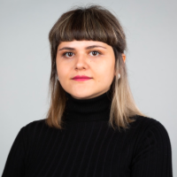

# Niloofar Rashvanloo 

> Hi there! I’m Niloofar, born and raised in Iran, and I’ve been living in Berlin since 2015. I’m currently expanding my skills in web development, focusing on front-end technologies, to take the next steps in my career.🚀

---

### 📫 Contact
- **Location:** Berlin
- **Email:** [niloo.bagherinezhad@gmail.com](mailto:niloo.bagherinezhad@gmail.com)

---

### 🎓 Education

- **Technical University of Berlin**  
  *Bachelor's in Computer Science* (October 2017 – no degree)

- **Azad University (IAU)**  
  *Bachelor's in Urban Planning* (2010 – 2014)

- **Farhikhtegan High School, Mashhad**  
  *High School Diploma in Mathematics* (October 2006 – September 2009)

---

### 🌍 Languages

| Language   | Proficiency              |
|------------|--------------------------|
| Deutsch    | Professional Working     |
| Persisch   | Native or Bilingual      |
| Englisch   | Professional Working     |
